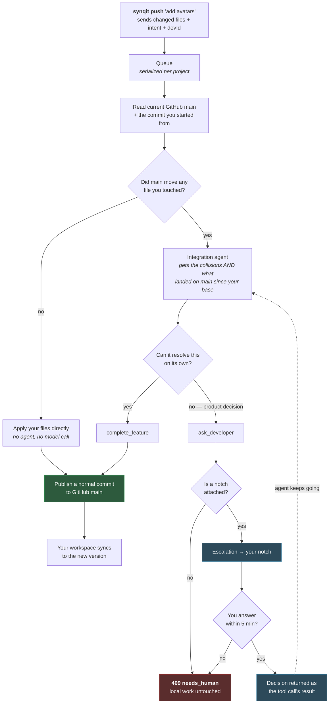
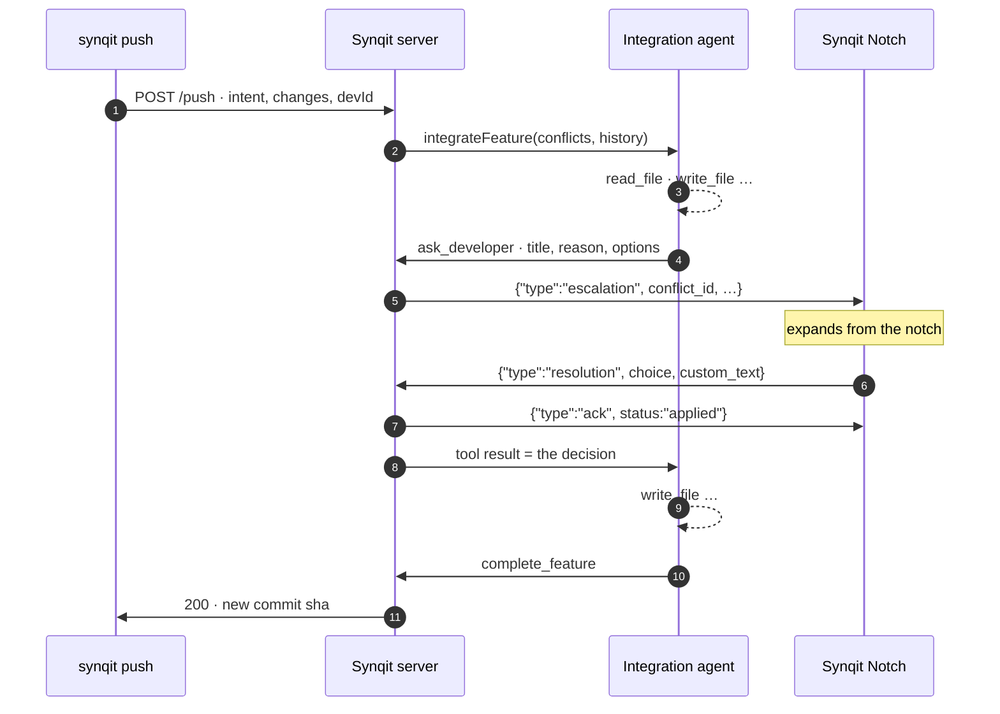
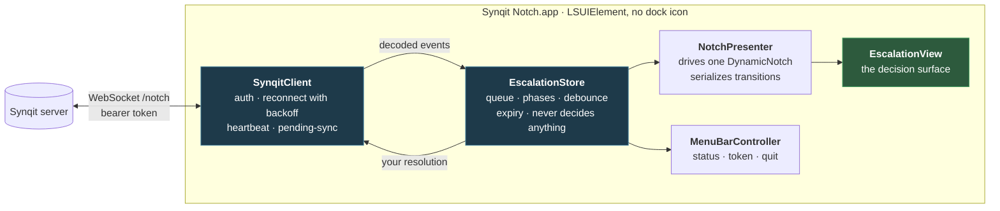

# Synqit Notch

The human-in-the-loop surface for [Synqit](../README.md). When the integration agent hits a
conflict it has no business deciding, it stops and asks the developer who pushed — in their
Mac's notch — then resumes with their answer.

A conflict becomes a question, not a rejected push.

<!-- The macOS app lives here. The server side is the .jac modules at the repo root. -->

---

## How it works

### The push

Everything below is what the code actually does. `synqit push` blocks for the whole of it.



Two things worth noticing:

**The left branch is free.** If nothing you touched has moved on `main`, your change applies
directly and no model runs at all.

**The dotted arrow is the whole feature.** `ask_developer` is not a failure exit — it is a
suspend. Your answer becomes that tool call's result and the agent carries on integrating.

### The escalation round trip



The push is held open the entire time. Because pushes are serialized per project, a decision
you are sitting on holds that project's queue — which is why it expires after five minutes
(`SYNQIT_DECISION_TIMEOUT_MS`).

### Inside the app



The store never mutates conflict state — it reflects the backend and relays your choice. On
every reconnect the backend's pending-sync is authoritative, so a laptop that was asleep
catches up rather than showing stale questions.

---

## Installation

### Requirements

- macOS 14+ (validated on macOS 26.5 / Xcode 26.4 / Swift 6.3)
- Python 3.12 — only for the Jac server at the repo root
- A running Synqit server, for real use

### 1. Build and install the app

```bash
git clone https://github.com/ben564885/jachacks26.git
cd jachacks26
make install          # builds release, assembles the .app, copies to /Applications
```

`make app` alone leaves it in `.build/` if you would rather not install it. The bundle is
ad-hoc signed, so on another Mac Gatekeeper blocks first launch — right-click → Open, or
`xattr -dr com.apple.quarantine "/Applications/Synqit Notch.app"`.

### 2. Attach it to Synqit

From any project already connected with `synqit init`:

```bash
synqit notch
open "/Applications/Synqit Notch.app"
```

That one command registers you with the server, writes `~/.synqit/config.json`, and stores a
server-issued token in your login keychain. Check it took:

```bash
synqit notch status
```

Turn on **Launch at login** from the menu-bar item and you are done — the surface is always
there, and a conflicting push now asks you instead of failing.

### Manual setup

If you are wiring it to something other than the Synqit CLI:

```bash
SynqitNotch --init                      # writes a starter ~/.synqit/config.json
```

```json
{
  "server_url": "wss://your-synqit-server/notch",
  "dev_id": "dev_ben"
}
```

```bash
SynqitNotch --login                     # paste the token, then Ctrl-D
```

Reading the token from stdin keeps it out of shell history. It goes to the login keychain,
never to disk.

| Command | Effect |
| --- | --- |
| `SynqitNotch` | Run the background app |
| `SynqitNotch --init` | Write a starter config |
| `SynqitNotch --login [TOKEN]` | Store a token (stdin if omitted) |
| `SynqitNotch --logout` | Remove the stored token |
| `SynqitNotch --status` | Print current configuration |

`SYNQIT_SERVER_URL` / `SYNQIT_DEV_ID` / `SYNQIT_TOKEN` override the config file. A login item
inherits no shell environment, so real installs must use the file.

### Try it against a local server

`NotchSocket` in [../notchsocket.jac](../notchsocket.jac) serves this wire contract, so
no separate mock is needed. Two terminals, from the repo root:

```bash
make serve            # the Jac server on :8080
make -C notch demo    # the notch, pointed at ws://127.0.0.1:8080/ws/NotchSocket
```

Fire a conflict the way the system really does — `jac run cli.jac -- push "…"` against a project
whose files have moved on `main`. The `Ask`, `Resolve`, `Pending` and `Withdraw` walkers in
[../escalation.jac](../escalation.jac) are the same seam over HTTP, but they are
authenticated (plain `walker`, not `walker:pub`), so those need a bearer token. Fire several to
see the queue badge; quit the notch, fire one, and restart it to watch pending-sync catch up.

---

## The contract

This is the entire seam. Any other surface — a web dashboard row, a physical desk button —
can consume the same events and emit the same resolution without the server changing.

**Escalation** (server → notch). Only `conflict_id`, `dev_id`, `title` and `summary` are
required; the notch renders what it is given.

```json
{
  "type": "escalation",
  "conflict_id": "c_b4d22156",
  "dev_id": "dev_ben",
  "title": "Free tier removal vs. unlimited free projects",
  "summary": "Your change gives free-tier users unlimited projects, but the free tier was deliberately removed on main 40s ago.",
  "file": "pricing.js",
  "colliding_edge": "pricing.js changed on main since your base",
  "your_change":  { "intent": "…", "diff_summary": "1 file changed from f50e1f3" },
  "their_change": { "dev_id": "ana", "intent": "Remove the free tier entirely", "diff_summary": "commit 31100eb on main" },
  "options": [
    { "id": "green", "label": "Keep mine",   "detail": "…" },
    { "id": "red",   "label": "Keep theirs", "detail": "…" },
    { "id": "other", "label": "Instruct",    "input": true }
  ],
  "expires_at": "2026-07-26T20:14:00Z"
}
```

**Resolution** (notch → server):

```json
{ "type": "resolution", "conflict_id": "c_b4d22156", "dev_id": "dev_ben", "choice": "red", "custom_text": null }
```

**Withdraw** (server → notch) — `resolved_elsewhere`, `expired`, or `superseded`:

```json
{ "type": "withdraw", "conflict_id": "c_b4d22156", "reason": "expired" }
```

Plus three the connection needs: `hello` and `fetch_pending` (notch → server) and `pending`
(server → notch, an array of active escalations), sent on every connect and reconnect. `ack`
is optional — without it the notch leaves its submitting state on a 4-second timeout and the
next pending-sync corrects the queue.

**Unknown `type` values are ignored, never acted on.** Inbound events are data.

---

## Layout

| Path | What it is |
| --- | --- |
| `Sources/SynqitNotch/Models/` | The wire contract |
| `Sources/SynqitNotch/Net/SynqitClient.swift` | Auth, reconnect, heartbeat, pending-sync |
| `Sources/SynqitNotch/State/EscalationStore.swift` | Queue, phases, debounce, expiry |
| `Sources/SynqitNotch/UI/` | Notch content and menu bar |
| `Scripts/bundle.sh` | Assembles and signs the `.app` |

## Notes on the build

**`DynamicNotchKit` is pinned to `exact: "1.1.0"`.** Its README documents a
`show()`/`hide()`/`toggle()` API that no longer exists. The real surface is
`expand(on:)`/`compact(on:)`/`hide()` — all `async` and `@MainActor`. Content views are captured
**once at init**, so the notch is built a single time and stays reactive through the
`EscalationStore` its views observe. Re-check those signatures before bumping.

**Transitions are chained, not concurrent.** Each library transition animates for ~0.4s and
they corrupt each other if overlapped, so the presenter serializes them through one task.

**The panel is a `.nonactivatingPanel` in an accessory app**, so the Instruct field gets no
keystrokes unless the app takes focus. It does that only when you open the field, and hands
focus back when you leave.

**Non-notch Macs and external displays** get DynamicNotchKit's floating capsule automatically.
The escalation appears on the screen under your cursor, never split across displays.

## Security

- Bearer token on the connection, scoped to one developer; TLS via `wss://`.
- Token lives in the login keychain (`com.synqit.notch`), keyed by `dev_id`.
- The client drops any escalation whose `dev_id` is not its own, and the server refuses a
  resolution for a conflict that is not yours — defence in depth on both ends.
- A plaintext `ws://` connection to anything but loopback is flagged in `--status`, in the
  menu bar, and in the log. It still connects; it just does not do so quietly.

## Tests

```bash
make test
```

29 tests over the wire contract and the state machine: the spec's exact payloads, queueing,
double-click debounce, withdraw, expiry, and pending-sync reconciliation.

The server side has six Jac suites of its own (`make test` at the repo root) covering conflict
detection, graph ingest, identity, workspaces and the escalation round trip, including
per-developer scoping and reconnect catch-up.

Beyond that, the whole flow has been run end to end against a real GitHub repository and a real
model: two developers, a genuinely incompatible pair of product intents, a question in the
notch, a click, and a commit on `main` that honoured the decision.
